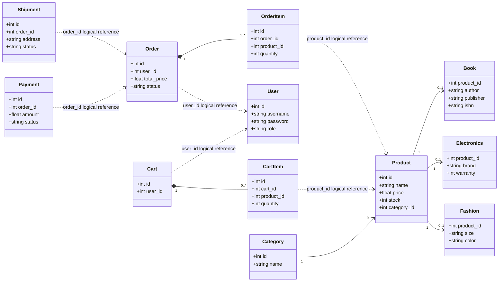
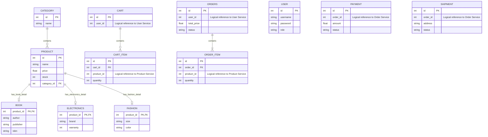

Đúng. Theo tài liệu, phần **2.3 đến 2.8** không chỉ quy định database mà còn quy định rõ **model Django của từng service**: `Product`, `Category`, `Book`, `Electronics`, `Fashion`, `User`, `Cart`, `CartItem`, `Order`, `OrderItem`, `Payment`, `Shipment`. Vì vậy context cho AI agent phải bao gồm cả **domain model / Django model / database mapping**, không chỉ schema SQL. 

Dưới đây là bản context đã bổ sung đầy đủ hơn.

---

# Context chuẩn cho AI Agent triển khai hệ thống E-Commerce Microservices

## 1. Mục tiêu triển khai

Triển khai hệ thống **E-Commerce Microservices** bằng **Django / Django REST Framework**, dựa trên phân tích thiết kế Chương 2.

Hệ thống gồm các service chính:

```text
product-service
user-service
cart-service
order-service
payment-service
shipping-service
```

Mỗi service là một bounded context riêng, có database riêng, không share database, không truy cập trực tiếp database của service khác. Các service giao tiếp qua REST API.

---

# 2. Nguyên tắc kiến trúc bắt buộc

AI agent phải tuân thủ:

```text
1. Mỗi service là một Django service độc lập.
2. Mỗi service có database riêng.
3. Không dùng chung database giữa các service.
4. Không tạo ForeignKey xuyên service/database.
5. Các quan hệ giữa service chỉ lưu bằng ID logic:
   - user_id
   - product_id
   - order_id
6. REST API là cơ chế giao tiếp chính giữa các service.
7. Mapping thiết kế:
   - Class -> Django Model
   - Django Model -> Database Table
   - Attribute -> Model Field -> Database Column
   - Relationship nội bộ service -> ForeignKey / OneToOneField
   - Relationship xuyên service -> IntegerField logical reference
8. Product Service dùng PostgreSQL.
9. User Service dùng MySQL.
10. Cart, Order, Payment, Shipping Service dùng MySQL.
```

---

# 3. Product Service

## 3.1. Trách nhiệm

`product-service` quản lý sản phẩm, danh mục sản phẩm và các loại sản phẩm cụ thể.

Theo tài liệu, Product Service có các nhóm sản phẩm:

```text
Book: giáo trình, tiểu thuyết
Electronics: mobile, laptop, tủ lạnh, điều hòa
Fashion: áo, quần, giày
```

## 3.2. Database lựa chọn

```text
Database: PostgreSQL
Database name: product_db
```

Lý do: Product Service có dữ liệu phức tạp, nhiều loại sản phẩm, quan hệ giữa sản phẩm tổng quát và sản phẩm chi tiết.

## 3.3. Django Models bắt buộc

### Category model

```python
class Category(models.Model):
    name = models.CharField(max_length=100)
```

Ý nghĩa:

```text
Category đại diện cho danh mục sản phẩm.
Một Category có thể chứa nhiều Product.
```

Database mapping:

```text
category
- id
- name
```

---

### Product model

```python
class Product(models.Model):
    name = models.CharField(max_length=255)
    price = models.FloatField()
    stock = models.IntegerField()
    category = models.ForeignKey(Category, on_delete=models.CASCADE)
```

Ý nghĩa:

```text
Product là model tổng quát cho mọi sản phẩm.
Mỗi Product thuộc một Category.
```

Database mapping:

```text
product
- id
- name
- price
- stock
- category_id
```

Relationship:

```text
Category 1 - n Product
product.category_id -> category.id
```

---

### Book model

```python
class Book(models.Model):
    product = models.OneToOneField(Product, on_delete=models.CASCADE)
    author = models.CharField(max_length=255)
    publisher = models.CharField(max_length=255)
    isbn = models.CharField(max_length=20)
```

Ý nghĩa:

```text
Book là thông tin chi tiết của sản phẩm loại sách.
Book mở rộng từ Product bằng quan hệ OneToOne.
```

Database mapping:

```text
book
- product_id
- author
- publisher
- isbn
```

Relationship:

```text
Product 1 - 1 Book
book.product_id -> product.id
```

---

### Electronics model

```python
class Electronics(models.Model):
    product = models.OneToOneField(Product, on_delete=models.CASCADE)
    brand = models.CharField(max_length=100)
    warranty = models.IntegerField()
```

Ý nghĩa:

```text
Electronics là thông tin chi tiết của sản phẩm điện tử.
Electronics mở rộng từ Product bằng quan hệ OneToOne.
```

Database mapping:

```text
electronics
- product_id
- brand
- warranty
```

Relationship:

```text
Product 1 - 1 Electronics
electronics.product_id -> product.id
```

---

### Fashion model

```python
class Fashion(models.Model):
    product = models.OneToOneField(Product, on_delete=models.CASCADE)
    size = models.CharField(max_length=10)
    color = models.CharField(max_length=50)
```

Ý nghĩa:

```text
Fashion là thông tin chi tiết của sản phẩm thời trang.
Fashion mở rộng từ Product bằng quan hệ OneToOne.
```

Database mapping:

```text
fashion
- product_id
- size
- color
```

Relationship:

```text
Product 1 - 1 Fashion
fashion.product_id -> product.id
```

## 3.4. API tối thiểu

```text
GET  /products/
POST /products/
GET  /products/{id}
```

Có thể bổ sung:

```text
GET  /categories/
POST /categories/
GET  /books/
GET  /electronics/
GET  /fashion/
```

---

# 4. User Service

## 4.1. Trách nhiệm

`user-service` quản lý người dùng, đăng ký, đăng nhập và phân quyền.

Các loại user:

```text
admin
staff
customer
```

Quyền:

```text
Admin: CRUD toàn bộ
Staff: xử lý order, shipping
Customer: mua hàng, xem sản phẩm
```

## 4.2. Database lựa chọn

```text
Database: MySQL
Database name: user_db
```

Lý do: MySQL phổ biến, phù hợp authentication.

## 4.3. Django Model bắt buộc

Theo tài liệu, User kế thừa `AbstractUser`.

```python
from django.contrib.auth.models import AbstractUser

class User(AbstractUser):
    ROLE_CHOICES = (
        ('admin', 'Admin'),
        ('staff', 'Staff'),
        ('customer', 'Customer'),
    )

    role = models.CharField(max_length=20, choices=ROLE_CHOICES)
```

Ý nghĩa:

```text
User là model người dùng của hệ thống.
User có thêm field role để phân quyền.
```

Database mapping:

```text
user
- id
- username
- password
- role
```

Lưu ý cho agent:

```text
Không bắt buộc tạo bảng Role riêng.
Trong tài liệu database 2.10.4, role được lưu trực tiếp trong bảng user bằng VARCHAR(20).
Nếu muốn bám sát đề, dùng field role trong User model.
```

## 4.4. API tối thiểu

```text
POST /auth/register
POST /auth/login
GET  /users/
```

---

# 5. Cart Service

## 5.1. Trách nhiệm

`cart-service` quản lý giỏ hàng của customer.

Chức năng:

```text
Add product vào cart
Update số lượng
Remove item
Xem cart
```

## 5.2. Database lựa chọn

```text
Database: MySQL
Database name: cart_db
```

## 5.3. Django Models bắt buộc

### Cart model

```python
class Cart(models.Model):
    user_id = models.IntegerField()
```

Ý nghĩa:

```text
Cart đại diện cho giỏ hàng của một user.
user_id là ID logic tham chiếu sang User Service.
Không tạo ForeignKey tới User.
```

Database mapping:

```text
cart
- id
- user_id
```

---

### CartItem model

```python
class CartItem(models.Model):
    cart = models.ForeignKey(Cart, on_delete=models.CASCADE)
    product_id = models.IntegerField()
    quantity = models.IntegerField()
```

Ý nghĩa:

```text
CartItem là sản phẩm nằm trong giỏ hàng.
Mỗi CartItem thuộc một Cart.
product_id là ID logic tham chiếu sang Product Service.
Không tạo ForeignKey tới Product.
```

Database mapping:

```text
cart_item
- id
- cart_id
- product_id
- quantity
```

Relationship nội bộ:

```text
Cart 1 - n CartItem
cart_item.cart_id -> cart.id
```

Relationship xuyên service:

```text
cart.user_id -> User Service, logical reference only
cart_item.product_id -> Product Service, logical reference only
```

## 5.4. API tối thiểu

```text
POST   /cart/add
GET    /cart/
DELETE /cart/remove
```

Có thể bổ sung:

```text
PUT /cart/update
```

---

# 6. Order Service

## 6.1. Trách nhiệm

`order-service` quản lý đơn hàng và chi tiết đơn hàng.

Workflow theo tài liệu:

```text
Tạo order từ cart
Gửi request sang payment-service
Sau khi thanh toán -> shipping
```

## 6.2. Database lựa chọn

```text
Database: MySQL
Database name: order_db
```

## 6.3. Django Models bắt buộc

### Order model

```python
class Order(models.Model):
    user_id = models.IntegerField()
    total_price = models.FloatField()
    status = models.CharField(max_length=50)
```

Ý nghĩa:

```text
Order đại diện cho đơn hàng.
user_id là ID logic tham chiếu sang User Service.
Không tạo ForeignKey tới User.
```

Database mapping:

```text
orders
- id
- user_id
- total_price
- status
```

Lưu ý:

```text
Tên Django model có thể là Order.
Tên database table nên là orders vì ORDER là từ khóa SQL.
```

---

### OrderItem model

```python
class OrderItem(models.Model):
    order = models.ForeignKey(Order, on_delete=models.CASCADE)
    product_id = models.IntegerField()
    quantity = models.IntegerField()
```

Ý nghĩa:

```text
OrderItem là chi tiết sản phẩm trong đơn hàng.
Mỗi OrderItem thuộc một Order.
product_id là ID logic tham chiếu sang Product Service.
Không tạo ForeignKey tới Product.
```

Database mapping:

```text
order_item
- id
- order_id
- product_id
- quantity
```

Relationship nội bộ:

```text
Order 1 - n OrderItem
order_item.order_id -> orders.id
```

Relationship xuyên service:

```text
orders.user_id -> User Service, logical reference only
order_item.product_id -> Product Service, logical reference only
```

## 6.4. Trạng thái đơn hàng gợi ý

Tài liệu chỉ quy định `status` là `CharField(max_length=50)`, chưa liệt kê enum cụ thể cho Order. Khi triển khai có thể dùng:

```text
Pending
Paid
Cancelled
Shipping
Completed
```

## 6.5. API gợi ý

Tài liệu không liệt kê API chi tiết cho Order Service, nhưng có workflow tạo order từ cart. Có thể triển khai tối thiểu:

```text
POST /orders/
GET  /orders/
GET  /orders/{id}
```

---

# 7. Payment Service

## 7.1. Trách nhiệm

`payment-service` quản lý thanh toán.

Chức năng:

```text
Nhận yêu cầu thanh toán
Lưu payment
Cập nhật trạng thái payment
Cho phép kiểm tra trạng thái payment
```

## 7.2. Database lựa chọn

```text
Database: MySQL
Database name: payment_db
```

## 7.3. Django Model bắt buộc

```python
class Payment(models.Model):
    order_id = models.IntegerField()
    amount = models.FloatField()
    status = models.CharField(max_length=50)
```

Ý nghĩa:

```text
Payment đại diện cho thanh toán của một order.
order_id là ID logic tham chiếu sang Order Service.
Không tạo ForeignKey tới Order.
```

Database mapping:

```text
payment
- id
- order_id
- amount
- status
```

Relationship xuyên service:

```text
payment.order_id -> Order Service, logical reference only
```

## 7.4. Trạng thái Payment

Theo tài liệu:

```text
Pending
Success
Failed
```

## 7.5. API tối thiểu

```text
POST /payment/pay
GET  /payment/status
```

Có thể bổ sung:

```text
GET /payment/status/{order_id}
```

---

# 8. Shipping Service

## 8.1. Trách nhiệm

`shipping-service` quản lý giao hàng.

Chức năng:

```text
Tạo shipment
Lưu địa chỉ giao hàng
Cập nhật trạng thái giao hàng
Kiểm tra trạng thái giao hàng
```

## 8.2. Database lựa chọn

```text
Database: MySQL
Database name: shipping_db
```

## 8.3. Django Model bắt buộc

```python
class Shipment(models.Model):
    order_id = models.IntegerField()
    address = models.TextField()
    status = models.CharField(max_length=50)
```

Ý nghĩa:

```text
Shipment đại diện cho thông tin giao hàng của một order.
order_id là ID logic tham chiếu sang Order Service.
Không tạo ForeignKey tới Order.
```

Database mapping:

```text
shipment
- id
- order_id
- address
- status
```

Relationship xuyên service:

```text
shipment.order_id -> Order Service, logical reference only
```

## 8.4. Trạng thái Shipment

Theo tài liệu:

```text
Processing
Shipping
Delivered
```

## 8.5. API tối thiểu

```text
POST /shipping/create
GET  /shipping/status
```

Có thể bổ sung:

```text
GET /shipping/status/{order_id}
```

---

# 9. Tổng hợp model theo service

| Service          | Django Model  | Database Table | Ghi chú                           |
| ---------------- | ------------- | -------------- | --------------------------------- |
| Product Service  | `Category`    | `category`     | Danh mục sản phẩm                 |
| Product Service  | `Product`     | `product`      | Sản phẩm tổng quát                |
| Product Service  | `Book`        | `book`         | Chi tiết sản phẩm sách            |
| Product Service  | `Electronics` | `electronics`  | Chi tiết sản phẩm điện tử         |
| Product Service  | `Fashion`     | `fashion`      | Chi tiết sản phẩm thời trang      |
| User Service     | `User`        | `user`         | Người dùng kế thừa `AbstractUser` |
| Cart Service     | `Cart`        | `cart`         | Giỏ hàng                          |
| Cart Service     | `CartItem`    | `cart_item`    | Chi tiết giỏ hàng                 |
| Order Service    | `Order`       | `orders`       | Đơn hàng                          |
| Order Service    | `OrderItem`   | `order_item`   | Chi tiết đơn hàng                 |
| Payment Service  | `Payment`     | `payment`      | Thanh toán                        |
| Shipping Service | `Shipment`    | `shipment`     | Giao hàng                         |

---

# 10. Quan hệ model cần triển khai

## 10.1. Quan hệ được phép dùng Django ForeignKey / OneToOneField

Các quan hệ này nằm **trong cùng service**, được dùng quan hệ Django thật:

```text
Product Service:
Category 1 - n Product
Product 1 - 1 Book
Product 1 - 1 Electronics
Product 1 - 1 Fashion

Cart Service:
Cart 1 - n CartItem

Order Service:
Order 1 - n OrderItem
```

Cách triển khai:

```python
category = models.ForeignKey(Category, on_delete=models.CASCADE)
product = models.OneToOneField(Product, on_delete=models.CASCADE)
cart = models.ForeignKey(Cart, on_delete=models.CASCADE)
order = models.ForeignKey(Order, on_delete=models.CASCADE)
```

---

## 10.2. Quan hệ không được dùng Django ForeignKey

Các quan hệ này nằm **khác service**, chỉ dùng `IntegerField`:

```text
Cart.user_id -> User Service
CartItem.product_id -> Product Service
Order.user_id -> User Service
OrderItem.product_id -> Product Service
Payment.order_id -> Order Service
Shipment.order_id -> Order Service
```

Cách triển khai đúng:

```python
user_id = models.IntegerField()
product_id = models.IntegerField()
order_id = models.IntegerField()
```

Không làm như sau:

```python
user = models.ForeignKey(User, on_delete=models.CASCADE)
product = models.ForeignKey(Product, on_delete=models.CASCADE)
order = models.ForeignKey(Order, on_delete=models.CASCADE)
```

Vì các model đó thuộc service khác và database khác.

---

# 11. Mermaid tổng hợp model/class theo thiết kế



---

# 12. Mermaid ERD tổng hợp database




