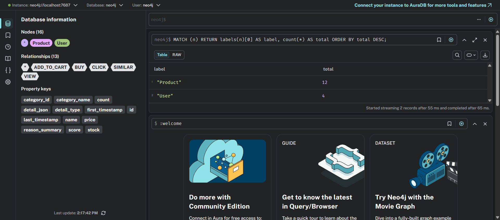
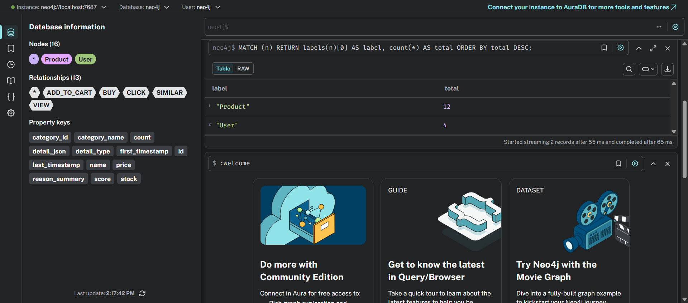
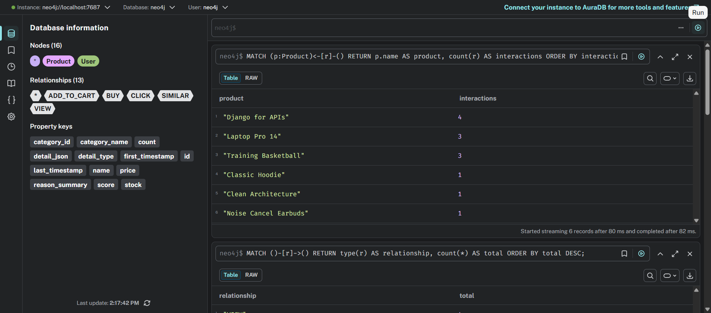
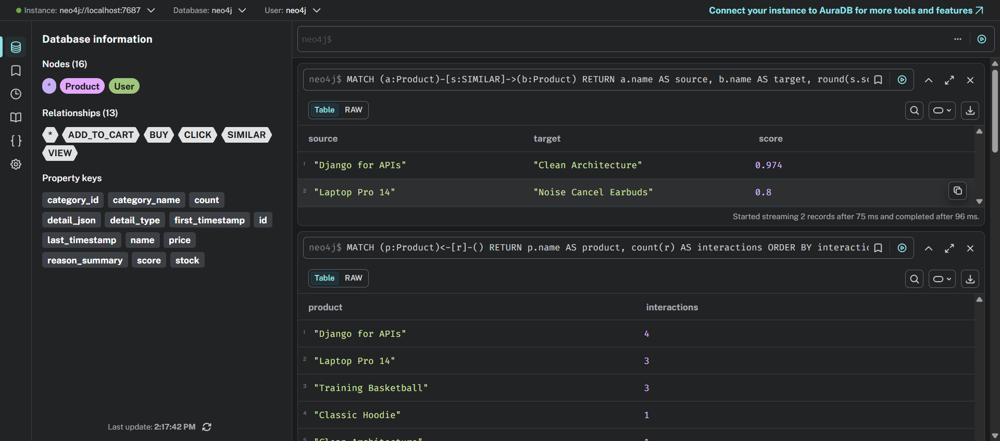
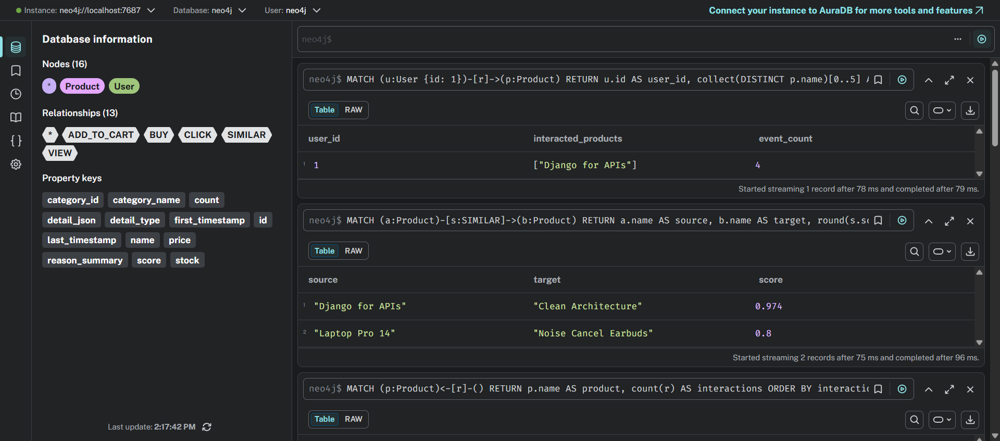
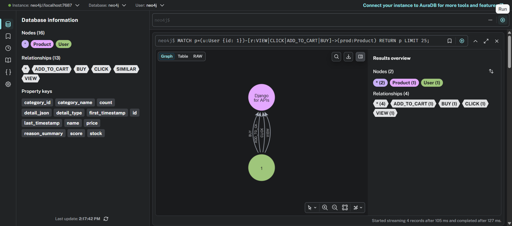
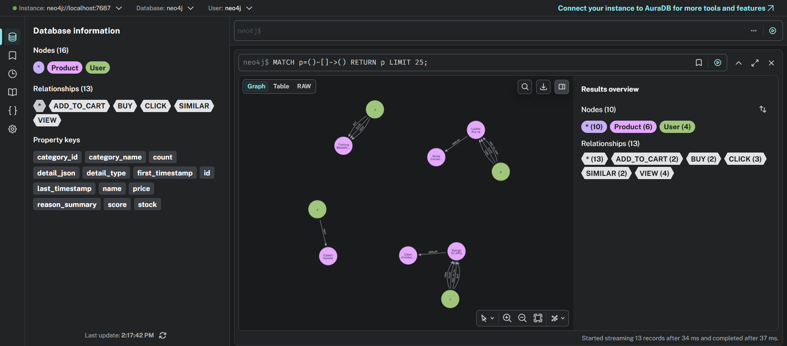
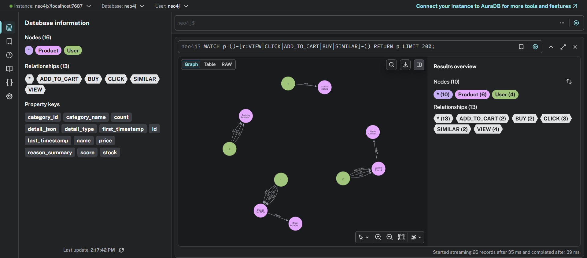

# CHƯƠNG 3. AI SERVICE CHO TƯ VẤN SẢN PHẨM

## 3.1. Mục tiêu và bối cảnh triển khai

Trong bối cảnh hệ thống thương mại điện tử đã được tổ chức theo kiến trúc microservice, mục tiêu của Chương 3 là bổ sung một lớp trí tuệ nhân tạo có khả năng tư vấn sản phẩm theo hai hướng chính: (i) đề xuất danh sách sản phẩm cá nhân hóa và (ii) chatbot tư vấn dựa trên truy vấn ngôn ngữ tự nhiên. Thay vì chỉ dừng ở mức ý tưởng, phần triển khai trong repo đã hiện thực thành một dịch vụ độc lập `ai-service`, có API rõ ràng, có pipeline dữ liệu, có mô hình học máy, có tích hợp frontend và có bằng chứng vận hành.

Về mặt học thuật, chương này tập trung vào một pipeline AI lai (hybrid): kết hợp học chuỗi hành vi bằng LSTM, tri thức quan hệ qua Knowledge Graph (Neo4j), và truy xuất ngữ nghĩa dạng lightweight qua TF-IDF + cosine (RAG fallback). Cách tiếp cận này phù hợp với điều kiện triển khai thực tế của đồ án: ưu tiên chạy ổn định trên Docker Compose, vẫn đảm bảo có mô hình thật, dữ liệu thật/synthetic có kiểm soát, và có khả năng trình diễn end-to-end.

Các đầu ra nghiệp vụ chính:
- API recommendation list (`GET /recommend`) trả về sản phẩm, điểm số, lý do gợi ý.
- API chatbot (`POST /chatbot`) trả về câu trả lời tư vấn, danh sách sản phẩm liên quan và ngữ cảnh truy xuất.

## 3.2. Kiến trúc tổng thể AI Service

`ai-service` được xây dựng bằng FastAPI, khởi tạo database trong vòng đời ứng dụng và đăng ký đầy đủ các router thành phần. Đoạn mã dưới đây cho thấy cấu trúc entrypoint của service:

```python
from contextlib import asynccontextmanager
from fastapi import FastAPI

from app.config import get_settings
from app.db import init_db
from app.routers.behavior import router as behavior_router
from app.routers.chatbot import router as chatbot_router
from app.routers.graph import router as graph_router
from app.routers.health import router as health_router
from app.routers.rag import router as rag_router
from app.routers.recommend import router as recommend_router

settings = get_settings()

@asynccontextmanager
async def lifespan(_: FastAPI):
    init_db()
    yield

app = FastAPI(
    title="AI Service",
    version="0.2.0",
    debug=settings.debug,
    lifespan=lifespan,
)

app.include_router(health_router)
app.include_router(behavior_router)
app.include_router(graph_router)
app.include_router(rag_router)
app.include_router(recommend_router)
app.include_router(chatbot_router)
```

**Đường dẫn file:** `ai-service/app/main.py`

Nhận xét: Đoạn entrypoint này thể hiện tư duy kiến trúc đúng cho microservice AI: khởi tạo tài nguyên dùng chung một lần, sau đó tách router theo miền chức năng. Cách tổ chức này giúp việc mở rộng thêm endpoint AI mới (ví dụ feature store hoặc online learning) trở nên an toàn và ít ảnh hưởng các phần còn lại.

Từ góc nhìn kiến trúc, luồng xử lý có thể mô tả ngắn gọn như sau:
1. Frontend gửi behavior event và truy vấn AI qua proxy nội bộ.
2. AI service thu thập dữ liệu hành vi + đồng bộ catalog sản phẩm.
3. Các nhánh mô hình (LSTM, Graph, RAG) tạo điểm số/candidate.
4. Khối hybrid scoring hợp nhất tín hiệu và trả về kết quả cuối.
5. Frontend hiển thị recommendation block và chatbot console.

[HÌNH 3.1 - Kiến trúc luồng tích hợp frontend và AI service, chèn từ: `docs/ai-service/screenshots/behavior-tracking-demo.png`]

Nhận xét: kiến trúc được thiết kế theo hướng “modular but practical” — mỗi kỹ thuật AI nằm ở module riêng (`ml`, `graph`, `rag`, `services`), giảm rủi ro “all-in-one file”, phù hợp tiêu chí bảo trì.

## 3.3. Thu thập và chuẩn hóa dữ liệu

### 3.3.1. Dữ liệu hành vi người dùng

Nền tảng của bài toán recommendation là dữ liệu hành vi. Trong triển khai hiện tại, service định nghĩa rõ schema hành vi, bao gồm `view`, `click`, `search`, `add_to_cart`, `buy`. Validation được triển khai ở tầng schema để đảm bảo tính đúng đắn nghiệp vụ (ví dụ `search` bắt buộc có `query_text`).

```python
BehaviorActionLiteral = Literal["view", "click", "search", "add_to_cart", "buy"]

class BehaviorEventCreate(BaseModel):
    user_id: int = Field(..., ge=1)
    product_id: int | None = Field(default=None, ge=1)
    action: BehaviorActionLiteral
    query_text: str | None = None
    timestamp: datetime | None = None

    @model_validator(mode="after")
    def validate_payload(self) -> "BehaviorEventCreate":
        if self.action == "search":
            if not self.query_text:
                raise ValueError("query_text is required for search events")
        elif self.product_id is None:
            raise ValueError("product_id is required for non-search events")
        ...
```

**Đường dẫn file:** `ai-service/app/schemas/behavior.py`

Nhận xét: Validation đặt ở schema là lựa chọn tốt vì chặn dữ liệu sai ngay tại ranh giới API. Nhờ đó, các tầng service/model phía sau có thể tập trung xử lý nghiệp vụ thay vì lặp lại kiểm tra đầu vào.

Tầng API cho behavior tracking:

```python
router = APIRouter(prefix="/behavior", tags=["behavior"])

@router.post("", response_model=BehaviorEventResponse, status_code=status.HTTP_201_CREATED)
def ingest_behavior_event(payload: BehaviorEventCreate, session: Session = Depends(get_session)):
    return create_behavior_event(session=session, payload=payload)

@router.get("/user/{user_id}", response_model=UserBehaviorHistoryResponse)
def get_user_behavior_history(user_id: int, session: Session = Depends(get_session)):
    return list_behavior_for_user(session=session, user_id=user_id)
```

**Đường dẫn file:** `ai-service/app/routers/behavior.py`

Nhận xét: Router được giữ mỏng, đẩy toàn bộ nghiệp vụ sang service; đây là mẫu thiết kế giúp kiểm thử dễ hơn và tránh “fat controller”.

Mô hình lưu trữ hành vi:

```python
class BehaviorEvent(Base):
    __tablename__ = "behavior_events"

    id: Mapped[int] = mapped_column(Integer, primary_key=True, index=True)
    user_id: Mapped[int] = mapped_column(Integer, index=True, nullable=False)
    product_id: Mapped[int | None] = mapped_column(Integer, index=True, nullable=True)
    action: Mapped[str] = mapped_column(String(32), index=True, nullable=False)
    query_text: Mapped[str | None] = mapped_column(Text, nullable=True)
    timestamp: Mapped[datetime] = mapped_column(DateTime(timezone=True), index=True, nullable=False)
```

**Đường dẫn file:** `ai-service/app/models/behavior.py`

Nhận xét: Thiết kế bảng hành vi đủ tối giản để truy vấn nhanh, nhưng vẫn giữ các trường cần thiết cho cả ba nhánh AI (LSTM, Graph, RAG), đặc biệt là `timestamp` để bảo toàn thứ tự sự kiện.

Về tích hợp frontend, hành vi được đẩy về AI service qua `frontend/lib/ai.ts` với endpoint `/ai/behavior`:

```typescript
export async function trackBehaviorEvent({
  userId,
  action,
  productId,
  queryText,
}: TrackBehaviorParams) {
  if (!userId) return null;
  const response = await api.post("/ai/behavior", {
    user_id: userId,
    action,
    product_id: productId,
    query_text: queryText,
  });
  return response.data;
}
```

**Đường dẫn file:** `frontend/lib/ai.ts`

Nhận xét: Việc gom toàn bộ lời gọi AI vào một client frontend thống nhất giúp giảm trùng lặp và giữ luồng tích hợp rõ ràng giữa UI với backend AI.

[SCREENSHOT 3.1 - Minh họa behavior tracking trong luồng frontend, chèn từ: `docs/ai-service/screenshots/behavior-tracking-demo.png`]

### 3.3.2. Dữ liệu sản phẩm và dữ liệu phục vụ recommendation

AI service không hard-code catalog mà lấy trực tiếp từ `product-service` thông qua client:

```python
class ProductServiceClient:
    def fetch_products(self) -> list[ProductCatalogItem]:
        with httpx.Client(base_url=self.base_url, timeout=self.timeout_seconds, transport=self.transport) as client:
            response = client.get("/products/")
            response.raise_for_status()
            payload = response.json()
        return [ProductCatalogItem.model_validate(item) for item in payload]
```

**Đường dẫn file:** `ai-service/app/clients/product_client.py`

Nhận xét: Tách riêng product client giúp `ai-service` phụ thuộc vào `product-service` theo giao diện rõ ràng; đây là bước quan trọng để dễ mock khi test và dễ thay đổi nguồn dữ liệu sau này.

Phase 3 đã tạo các artifact dữ liệu phục vụ tái lập pipeline:
- `phase-3-product-snapshot.json`
- `phase-3-product-document-corpus.jsonl`
- `phase-3-cleaned-behavior-dataset.csv`
- `phase-3-synthetic-behavior-dataset.csv`
- `phase-3-sequence-dataset.json`
- `phase-3-train-val-test-split.json`

[BIỂU ĐỒ 3.1 - Phân bố category, chèn từ: `docs/ai-service/artifacts/plots/phase-3-category-distribution.png`]  
[BIỂU ĐỒ 3.2 - Phân bố detail type, chèn từ: `docs/ai-service/artifacts/plots/phase-3-detail-type-distribution.png`]  
[BIỂU ĐỒ 3.3 - Phân bố độ dài chuỗi, chèn từ: `docs/ai-service/artifacts/plots/phase-3-sequence-length-distribution.png`]

Nhận xét: nhóm đã dùng synthetic dataset có seed cố định để giải quyết vấn đề dữ liệu thật còn hạn chế, nhưng vẫn giữ được logic hành vi mua sắm hợp lý (`view -> click -> add_to_cart -> buy`), phù hợp yêu cầu demo học thuật.

## 3.4. Mô hình LSTM cho dự đoán sản phẩm tiếp theo

### 3.4.1. Ý tưởng mô hình

Bài toán được xây dựng như một bài toán dự đoán next-item từ chuỗi tương tác sản phẩm theo thời gian. LSTM được lựa chọn vì khả năng nắm bắt phụ thuộc theo thứ tự, phù hợp với dữ liệu chuỗi hành vi người dùng.

### 3.4.2. Thiết kế mạng LSTM

```python
class NextProductLSTM(nn.Module):
    def __init__(self, vocab_size: int, embedding_dim: int, hidden_dim: int, pad_token_id: int = 0, ...):
        super().__init__()
        self.embedding = nn.Embedding(
            num_embeddings=vocab_size + 1,
            embedding_dim=embedding_dim,
            padding_idx=pad_token_id,
        )
        self.lstm = nn.LSTM(
            input_size=embedding_dim,
            hidden_size=hidden_dim,
            num_layers=num_layers,
            batch_first=True,
            dropout=lstm_dropout,
        )
        self.dropout = nn.Dropout(dropout)
        self.output = nn.Linear(hidden_dim, vocab_size + 1)

    def forward(self, input_ids: Tensor, lengths: Tensor) -> Tensor:
        embedded = self.embedding(input_ids)
        packed = nn.utils.rnn.pack_padded_sequence(embedded, lengths.cpu(), batch_first=True, enforce_sorted=False)
        _, (hidden_state, _) = self.lstm(packed)
        final_hidden = hidden_state[-1]
        logits = self.output(self.dropout(final_hidden))
        return logits
```

**Đường dẫn file:** `ai-service/app/ml/lstm_model.py`

Nhận xét: Kiến trúc Embedding + LSTM + Linear là cấu hình kinh điển cho bài toán next-item prediction; việc dùng `pack_padded_sequence` cho thấy triển khai đã quan tâm đúng đến chuỗi có độ dài biến thiên.

### 3.4.3. Huấn luyện, đánh giá và artifact runtime

Pipeline huấn luyện trong `train_and_evaluate_lstm` bao gồm:
- tiền xử lý chuỗi,
- thử nghiệm nhiều cấu hình,
- chọn mô hình tốt nhất theo top-k/NDCG/MRR,
- lưu model + metadata runtime.

```python
def train_and_evaluate_lstm(...):
    ...
    best_result = max(
        experiment_results,
        key=lambda item: (item.metrics.topk_accuracy[3], item.metrics.ndcg_at_k[5], item.metrics.mrr),
    )
    ...
    runtime_model_path = runtime_dir / "best_lstm_model.pt"
    runtime_metadata_path = runtime_dir / "lstm_metadata.json"
    torch.save({...}, runtime_model_path)
    runtime_metadata_path.write_text(json.dumps(...), encoding="utf-8")
```

**Đường dẫn file:** `ai-service/app/ml/train_lstm.py`

Nhận xét: Điểm mạnh của pipeline train là có bước chọn mô hình tốt nhất dựa trên metric xếp hạng thay vì chỉ accuracy thuần, phù hợp bản chất bài toán recommendation.

Script chạy huấn luyện:

```python
from app.ml.train_lstm import train_and_evaluate_lstm

def main() -> None:
    result = train_and_evaluate_lstm()
    print(result["message"])
```

**Đường dẫn file:** `ai-service/scripts/train_lstm.py`

Nhận xét: Script wrapper ngắn gọn giúp vận hành thuận tiện trong Docker/CI, đồng thời tách logic nghiệp vụ huấn luyện khỏi lớp thực thi command-line.

Với suy luận online, service có cơ chế fallback sang popularity khi model không khả dụng hoặc lịch sử user quá ngắn:

```python
if runtime_payload is None:
    return self._fallback_result(reason="model artifact not available", top_k=top_k)
...
if len(history) < min_history:
    return self._fallback_result(reason="user history too short", top_k=top_k)
```

**Đường dẫn file:** `ai-service/app/services/lstm_service.py`

Nhận xét: Cơ chế fallback được thiết kế đúng vai trò production safety net: khi model chưa sẵn sàng, hệ thống vẫn trả kết quả có kiểm soát thay vì lỗi 500.

[BIỂU ĐỒ 3.4 - Training loss curve, chèn từ: `docs/ai-service/plots/lstm/training_loss_curve.png`]  
[BIỂU ĐỒ 3.5 - Validation loss curve, chèn từ: `docs/ai-service/plots/lstm/validation_loss_curve.png`]  
[BIỂU ĐỒ 3.6 - Top-k accuracy comparison, chèn từ: `docs/ai-service/plots/lstm/topk_accuracy_comparison.png`]  
[BIỂU ĐỒ 3.7 - Precision/Recall@k, chèn từ: `docs/ai-service/plots/lstm/precision_recall_at_k.png`]  
[BIỂU ĐỒ 3.8 - Baseline vs LSTM, chèn từ: `docs/ai-service/plots/lstm/baseline_vs_lstm.png`]

Artifact runtime xác nhận:
- `ai-service/artifacts/lstm/best_lstm_model.pt`
- `ai-service/artifacts/lstm/lstm_metadata.json`

## 3.5. Knowledge Graph với Neo4j

### 3.5.1. Mô hình đồ thị

Đồ thị tri thức được triển khai với:
- Node: `User`, `Product`
- Edge tương tác: `VIEW`, `CLICK`, `ADD_TO_CART`, `BUY`
- Edge tương đồng: `SIMILAR`

Lõi tính `SIMILAR`:

```python
if source.category == target.category:
    score += 0.35
if source.detail_type == target.detail_type:
    score += 0.35
...
if price_similarity >= 0.8:
    score += 0.2 * price_similarity
...
if overlap:
    keyword_score = len(overlap) / union_size
    score += min(0.1, keyword_score)
```

**Đường dẫn file:** `ai-service/app/services/graph.py`

Nhận xét: Hàm similarity dùng heuristic có trọng số là lựa chọn thực tế trong bối cảnh dữ liệu chưa lớn; nó tạo được tín hiệu quan hệ đủ tốt để bổ trợ cho hybrid scoring.

### 3.5.2. Đồng bộ dữ liệu vào graph

```python
def sync_graph(session: Session, store: Neo4jGraphStore | Any, client: ProductServiceClient | None = None):
    products = fetch_product_catalog(client=client)
    events = session.scalars(select(BehaviorEvent).order_by(...)).all()
    store.clear_graph()
    ...
    for event in events:
        if event.product_id is None or event.action == "search":
            continue
        store.add_interaction(...)
    ...
    for edge in similar_edges:
        store.add_similarity(...)
```

**Đường dẫn file:** `ai-service/app/services/graph.py`

Nhận xét: Quy trình sync vừa cập nhật node vừa cập nhật edge cho thấy nhóm đã triển khai graph “thật”, không dừng ở mức minh họa tĩnh.

Router và script sync:

```python
@router.post("/sync", response_model=GraphSyncResponse)
def graph_sync(session: Session = Depends(get_session)) -> GraphSyncResponse:
    with Neo4jGraphStore() as store:
        return sync_graph(session=session, store=store, client=ProductServiceClient())
```

**Đường dẫn file:** `ai-service/app/routers/graph.py`

Nhận xét: Router graph cung cấp đủ hai thao tác cốt lõi: đồng bộ và khai thác; đây là cấu trúc API phù hợp cho chu trình offline/online của Knowledge Graph.

```python
with Neo4jGraphStore() as store:
    result = sync_graph(session=session, store=store, client=ProductServiceClient())
```

**Đường dẫn file:** `ai-service/scripts/sync_graph.py`

Nhận xét: Có script độc lập giúp chạy lại graph pipeline theo batch, thuận tiện cho demo và tái lập kết quả khi dữ liệu nguồn thay đổi.

### 3.5.3. Truy vấn gợi ý từ graph

Nếu không có recommendation từ neighborhood, service fallback về graph popularity:

```python
rows = store.get_user_recommendations(user_id=user_id, limit=limit)
if not rows:
    exclude_ids = store.get_user_interacted_product_ids(user_id=user_id)
    rows = [...]
```

**Đường dẫn file:** `ai-service/app/services/graph.py`

Nhận xét: Nhánh fallback popularity trong graph recommendation giúp tránh trạng thái “rỗng kết quả”, đặc biệt hữu ích cho người dùng mới hoặc history thưa.

[BIỂU ĐỒ 3.9 - Node/edge counts, chèn từ: `docs/ai-service/artifacts/plots/phase-4-node-edge-counts.png`]  
[BIỂU ĐỒ 3.10 - Relationship distribution, chèn từ: `docs/ai-service/artifacts/plots/phase-4-relationship-distribution.png`]

#### Truy vấn Neo4j thực thi trực tiếp và ảnh chụp kết quả

Để tăng tính thuyết phục của phần đồ thị, nhóm đã chạy trực tiếp các truy vấn Cypher trên Neo4j Browser tại `http://localhost:7474/browser/` và chụp lại màn hình kết quả.

**Query 1 - Thống kê số lượng node theo nhãn**

```cypher
MATCH (n)
RETURN labels(n)[0] AS label, count(*) AS total
ORDER BY total DESC;
```



**Query 2 - Thống kê số lượng quan hệ theo loại**

```cypher
MATCH ()-[r]->()
RETURN type(r) AS relationship, count(*) AS total
ORDER BY total DESC;
```



**Query 3 - Top sản phẩm có nhiều tương tác**

```cypher
MATCH (p:Product)<-[r]-()
RETURN p.name AS product, count(r) AS interactions
ORDER BY interactions DESC
LIMIT 10;
```



**Query 4 - Các cạnh SIMILAR và điểm tương đồng**

```cypher
MATCH (a:Product)-[s:SIMILAR]->(b:Product)
RETURN a.name AS source, b.name AS target, round(s.score, 3) AS score
LIMIT 10;
```



**Query 5 - Dấu vết tương tác của user mẫu**

```cypher
MATCH (u:User {id: 1})-[r]->(p:Product)
RETURN u.id AS user_id, collect(DISTINCT p.name)[0..5] AS interacted_products, count(r) AS event_count;
```



**Query 6 - Truy vấn mạng node/edge trực quan cho user-product**

```cypher
MATCH p=(u:User {id: 1})-[r:VIEW|CLICK|ADD_TO_CART|BUY]->(prod:Product)
RETURN p
LIMIT 25;
```



**Query 7 - Truy vấn toàn mạng quan hệ (dạng chằng chịt nhiều node)**

```cypher
MATCH p=()-[]->()
RETURN p
LIMIT 25;
```



**Query 8 - Truy vấn mạng dày nhất theo toàn bộ loại quan hệ**

```cypher
MATCH p=()-[r:VIEW|CLICK|ADD_TO_CART|BUY|SIMILAR]-()
RETURN p
LIMIT 200;
```



Nhận xét: các truy vấn trên xác nhận nhất quán giữa dữ liệu đồ thị và báo cáo phase 4 (node/edge tồn tại, có cạnh `SIMILAR`, có tín hiệu tương tác user-product phục vụ gợi ý).

## 3.6. RAG / Retrieval

### 3.6.1. Pipeline retrieval

Trong trạng thái hiện tại của repo, retrieval được triển khai theo hướng TF-IDF + cosine với chỉ mục cục bộ. Quy trình rebuild index:

```python
documents = _load_rag_documents(client=client)
matrix_payload = _build_tfidf_matrix(documents)
...
with runtime_paths["matrix"].open("wb") as handle:
    pickle.dump(matrix_payload, handle)
runtime_paths["documents"].write_text(json.dumps([...]), encoding="utf-8")
runtime_paths["metadata"].write_text(json.dumps(metadata, indent=2), encoding="utf-8")
```

**Đường dẫn file:** `ai-service/app/services/rag.py`

Nhận xét: Việc lưu cả matrix, documents và metadata cho thấy tư duy runtime-complete artifact; hệ thống có thể khởi động và truy xuất mà không cần rebuild mỗi lần.

Router rebuild-index:

```python
@router.post("/rebuild-index", response_model=RagRebuildResponse)
def rebuild_index() -> RagRebuildResponse:
    return rebuild_rag_index()
```

**Đường dẫn file:** `ai-service/app/routers/rag.py`

Nhận xét: Endpoint rebuild-index là điểm điều khiển cần thiết cho vận hành thực tế, cho phép làm mới tri thức khi catalog thay đổi.

### 3.6.2. Lưu trữ vector/index và quyết định kỹ thuật

Ba artifact runtime quan trọng:
- `ai-service/artifacts/rag/tfidf_cosine_index.pkl`
- `ai-service/artifacts/rag/tfidf_cosine_documents.json`
- `ai-service/artifacts/rag/tfidf_cosine_metadata.json`

Nhận xét kỹ thuật: đề bài ưu tiên FAISS nếu hỗ trợ, tuy nhiên implementation hiện chọn TF-IDF local nhằm tối ưu tính ổn định và dễ vận hành trong môi trường compose nhiều service. Đây là một quyết định hợp lệ khi có nêu rõ giới hạn semantic.

[BIỂU ĐỒ 3.11 - Retrieval latency, chèn từ: `docs/ai-service/plots/rag/retrieval_latency.png`]  
[BIỂU ĐỒ 3.12 - Top-k score distribution, chèn từ: `docs/ai-service/plots/rag/topk_score_distribution.png`]  
[BIỂU ĐỒ 3.13 - Index build time, chèn từ: `docs/ai-service/plots/rag/index_build_time.png`]

### 3.6.3. Vai trò của retrieval trong recommendation và chatbot

Trong recommendation, RAG tạo candidate theo query:

```python
if cleaned_query:
    rag_rows = retrieve_products(cleaned_query, top_k=max(limit * 2, 5), client=effective_client)
    if rag_rows:
        source_availability["rag"] = True
        add_candidates(... source="rag", ...)
```

**Đường dẫn file:** `ai-service/app/services/recommend.py`

Nhận xét: Đoạn hợp nhất candidate từ RAG vào hybrid pipeline thể hiện kiến trúc mở: mỗi nguồn tín hiệu được thêm theo cùng một giao thức và có thể bật/tắt linh hoạt.

Trong chatbot, RAG là đầu vào cốt lõi của câu trả lời grounded:

```python
query_type = classify_query_type(query)
rag_results = retrieve_products(expand_query_for_rag(query=query, query_type=query_type), top_k=5)
...
answer = build_chatbot_answer(query=query, query_type=query_type, products=suggestions)
```

**Đường dẫn file:** `ai-service/app/services/chatbot.py`

Nhận xét: Chatbot không sinh câu trả lời thuần template một cách mù, mà bám trên kết quả retrieval và có bước rerank theo user signal, tăng tính “grounded”.

## 3.7. Kết hợp Hybrid Model

Lõi của hệ thống recommendation nằm ở việc hợp nhất tín hiệu đa nguồn. Công thức trọng số cơ sở được khai báo:

```python
BASE_WEIGHTS: dict[str, float] = {
    "lstm": 0.4,
    "graph": 0.3,
    "rag": 0.3,
    "popularity": 0.2,
}
```

**Đường dẫn file:** `ai-service/app/services/recommend.py`

Nhận xét: Khai báo trọng số tường minh giúp mô hình lai có tính giải thích cao; đây là điểm mạnh khi cần bảo vệ đồ án trước hội đồng.

Trọng số được chuẩn hóa lại theo nguồn khả dụng thực tế:

```python
weighted_sources = {
    source: weight
    for source, weight in BASE_WEIGHTS.items()
    if source_availability.get(source)
}
normalized_weights = normalize_weights(weighted_sources)
...
final_score = sum(
    normalized_weights.get(source, 0.0) * score
    for source, score in candidate.source_scores.items()
)
```

**Đường dẫn file:** `ai-service/app/services/recommend.py`

Nhận xét: Chuẩn hóa trọng số theo nguồn khả dụng là quyết định kỹ thuật quan trọng, vì nó giúp hệ thống ổn định ngay cả khi một số thành phần tạm thời không có dữ liệu.

Điểm mạnh của hybrid là giảm rủi ro “điểm mù” của từng mô hình đơn:
- LSTM mạnh về tuần tự hành vi.
- Graph mạnh về quan hệ cấu trúc.
- RAG mạnh khi có query ngôn ngữ tự nhiên.
- Popularity đảm bảo không rỗng kết quả trong cold-start.

[BIỂU ĐỒ 3.14 - Source score comparison, chèn từ: `docs/ai-service/plots/hybrid/source_score_comparison.png`]  
[BIỂU ĐỒ 3.15 - Model ablation comparison, chèn từ: `docs/ai-service/plots/hybrid/model_ablation_comparison.png`]  
[BIỂU ĐỒ 3.16 - Baseline vs LSTM vs Graph vs RAG vs Hybrid, chèn từ: `docs/ai-service/plots/hybrid/baseline_vs_lstm_vs_graph_vs_rag_vs_hybrid.png`]

## 3.8. Hai dạng AI Service triển khai cho người dùng cuối

### 3.8.1. Recommendation list

API được mở qua router:

```python
@router.get("/recommend", response_model=RecommendationResponse)
def recommend(
    user_id: int = Query(..., ge=1),
    query: str | None = Query(None, min_length=1),
    limit: int = Query(5, ge=1, le=20),
    session: Session = Depends(get_session),
) -> RecommendationResponse:
    return recommend_products(session=session, user_id=user_id, query=query, limit=limit)
```

**Đường dẫn file:** `ai-service/app/routers/recommend.py`

Nhận xét: Thiết kế tham số `user_id`, `query`, `limit` đáp ứng tốt cả hai ngữ cảnh: cá nhân hóa thuần hành vi và truy vấn có ngữ nghĩa theo nhu cầu tức thời.

Schema response thể hiện rõ tính giải thích:

```python
class RecommendationItem(BaseModel):
    id: int
    name: str
    price: float
    category: str
    detail_type: str
    score: float
    reason: str
    source_scores: dict[str, float]
```

**Đường dẫn file:** `ai-service/app/schemas/recommend.py`

Nhận xét: Việc trả thêm `reason` và `source_scores` giúp recommendation có khả năng giải trình, tránh cảm giác “black-box” ở tầng ứng dụng.

[SCREENSHOT 3.2 - Recommendation UI trên trang chủ, chèn từ: `docs/ai-service/screenshots/recommendation-ui.png`]

### 3.8.2. Chatbot tư vấn sản phẩm

Router chatbot:

```python
@router.post("/chatbot", response_model=ChatbotResponse)
def chatbot(request: ChatbotRequest, session: Session = Depends(get_session)) -> ChatbotResponse:
    return generate_chatbot_response(session=session, payload=request)
```

**Đường dẫn file:** `ai-service/app/routers/chatbot.py`

Nhận xét: Router chatbot giữ đúng vai trò “cổng vào”, còn logic hội thoại đặt ở service; cách tách này giúp dễ nâng cấp sang multi-turn state trong tương lai.

Schema response:

```python
class ChatbotResponse(BaseModel):
    answer: str
    products: list[ChatbotProductSuggestion]
    retrieved_context: list[str]
    query_type: str
```

**Đường dẫn file:** `ai-service/app/schemas/chatbot.py`

Nhận xét: Cấu trúc response gồm `answer`, `products`, `retrieved_context` là hợp lý cho chatbot tư vấn sản phẩm vì vừa có nội dung ngôn ngữ vừa có bằng chứng truy xuất.

Tầng frontend đã có trang chatbot độc lập, gọi API và hiển thị cả context:

```typescript
const chatbotMutation = useMutation({
  mutationFn: async (nextMessage: string) =>
    sendChatbotMessage({
      userId: user?.id,
      message: nextMessage,
    }),
  onSuccess: (response, prompt) => {
    ...
    void trackBehaviorEvent({
      userId: user?.id,
      action: "search",
      queryText: prompt,
    });
  },
});
```

**Đường dẫn file:** `frontend/app/chatbot/page.tsx`

Nhận xét: Frontend chatbot đã gắn luôn tracking event sau mỗi lần hỏi, qua đó khép kín vòng phản hồi dữ liệu cho pipeline recommendation về sau.

[SCREENSHOT 3.3 - Chatbot UI, chèn từ: `docs/ai-service/screenshots/chatbot-ui.png`]

## 3.9. Triển khai hệ thống và tích hợp liên dịch vụ

Trong `docker-compose.yml`, ba thành phần bắt buộc của AI stack đều đã hiện diện:
- `ai-db` (PostgreSQL)
- `neo4j`
- `ai-service`

```yaml
ai-db:
  image: postgres:16
  ...

neo4j:
  image: neo4j:5
  ...

ai-service:
  build: ./ai-service
  depends_on:
    - ai-db
    - neo4j
    - product-service
    - order-service
```

**Đường dẫn file:** `docker-compose.yml`

Nhận xét: Compose thể hiện rõ phụ thuộc hạ tầng của AI service (DB + Neo4j + service nguồn), chứng minh khả năng chạy thực tế chứ không chỉ mô phỏng cục bộ.

Tầng frontend dùng gateway route để proxy prefix `ai`:

```typescript
const SERVICE_MAP: Record<string, string | undefined> = {
  ...
  ai: process.env.AI_SERVICE_URL,
};

const normalizedPath = prefix === "ai"
  ? `/${rest.join("/")}`
  : `/${pathArray.join("/")}`;
```

**Đường dẫn file:** `frontend/app/api/[...path]/route.ts`

Nhận xét: Cơ chế proxy theo prefix `ai` giúp giữ nguyên kiến trúc gateway hiện hữu, đồng thời giảm coupling giữa frontend và địa chỉ backend cụ thể.

Nhận xét: cách tích hợp này giữ được tính nhất quán với kiến trúc gateway hiện có của dự án, tránh việc frontend phải gọi trực tiếp nhiều service URL khác nhau.

## 3.10. Kết quả thực hiện theo yêu cầu đề bài

Bảng tổng hợp dưới đây đối chiếu yêu cầu Chương 3 với phần hiện thực thực tế trong repo.

| Yêu cầu đề bài | Hiện thực trong repo | File code chính | Evidence |
| --- | --- | --- | --- |
| Theo dõi hành vi người dùng | Có API ghi/lấy history, có validation action | `ai-service/app/routers/behavior.py`, `ai-service/app/schemas/behavior.py`, `ai-service/app/services/behavior.py` | `docs/ai-service/ai-service-smoke-test.md` |
| Mô hình LSTM thật | Có model PyTorch, train/eval, artifact runtime, fallback | `ai-service/app/ml/lstm_model.py`, `ai-service/app/ml/train_lstm.py`, `ai-service/app/services/lstm_service.py` | `docs/ai-service/reports/phase-6-lstm-evaluation.md`, `ai-service/artifacts/lstm/` |
| Knowledge Graph Neo4j | Có sync graph và recommend graph | `ai-service/app/services/graph.py`, `ai-service/app/routers/graph.py`, `ai-service/scripts/sync_graph.py` | `docs/ai-service/reports/phase-4-graph-report.md` |
| RAG/vector retrieval | Có rebuild index, retrieve top-k, lưu index runtime | `ai-service/app/services/rag.py`, `ai-service/app/routers/rag.py`, `ai-service/scripts/rebuild_rag_index.py` | `docs/ai-service/reports/phase-5-rag-report.md`, `ai-service/artifacts/rag/` |
| Hybrid recommendation API | Có hợp nhất điểm nhiều nguồn + lý do giải thích | `ai-service/app/services/recommend.py`, `ai-service/app/routers/recommend.py` | `docs/ai-service/reports/phase-7-hybrid-recommendation-report.md` |
| Chatbot tư vấn | Có pipeline query -> retrieve -> answer grounded | `ai-service/app/services/chatbot.py`, `ai-service/app/routers/chatbot.py` | `docs/ai-service/reports/phase-8-chatbot-report.md` |
| Tích hợp frontend | Có block recommendation + chatbot page + tracking event | `frontend/app/page.tsx`, `frontend/app/chatbot/page.tsx`, `frontend/lib/ai.ts` | `docs/ai-service/screenshots/*.png` |

## 3.11. Đánh giá theo checklist Chương 3

1. **Có pipeline AI rõ ràng:** Đạt.  
   Pipeline được tách module và có tài liệu hóa rõ từ ingestion đến inference.

2. **Có LSTM thật:** Đạt.  
   Có lớp mô hình PyTorch, có script train, có artifact `.pt`, có báo cáo metric.

3. **Có Graph và RAG:** Đạt.  
   Có Neo4j sync/recommend và retrieval runtime với index cục bộ.

4. **Có API hoạt động:** Đạt.  
   Bộ endpoint chính đã hiện diện và có tài liệu smoke test.

5. **Có tích hợp frontend để demo:** Đạt.  
   Trang chủ có recommendation block, có chatbot page riêng, có screenshot minh họa.

Nhận xét tổng quan: phần triển khai đáp ứng tương đối đầy đủ tinh thần đề bài “hệ thống AI có thể chạy và demo được”, không chỉ dừng ở mô tả lý thuyết.

## 3.12. Hạn chế và hướng phát triển

Các hạn chế phù hợp với implementation hiện tại:
- Hybrid weighting đang heuristic, chưa học trọng số động từ feedback thực tế.
- Chatbot hiện dùng template-grounded generation, chưa tích hợp external LLM.
- Retrieval theo TF-IDF chưa mạnh về ngữ nghĩa sâu (synonym/paraphrase).
- Chất lượng cá nhân hóa phụ thuộc quy mô dữ liệu hành vi và catalog hiện có.

Hướng phát triển đề xuất:
1. Bổ sung dense embedding + FAISS để tăng semantic recall.
2. Học trọng số hybrid từ conversion signal theo thời gian.
3. Mở rộng intent parsing và chiến lược sinh ngôn ngữ cho chatbot.
4. Tăng cường đánh giá online/offline với tập dữ liệu thực lớn hơn.

## 3.13. Kết luận chương

Chương 3 đã xây dựng thành công một AI service có tính ứng dụng thực tế trong hệ thống thương mại điện tử đa dịch vụ. Giá trị cốt lõi của giải pháp nằm ở khả năng kết hợp đa nguồn tín hiệu (hành vi chuỗi, quan hệ đồ thị, truy xuất theo ngôn ngữ tự nhiên) để đưa ra tư vấn sản phẩm có căn cứ. Kết quả triển khai cho thấy hệ thống đã đạt được cả mục tiêu kỹ thuật (service chạy được, API vận hành, artifact runtime sẵn sàng) và mục tiêu học thuật (có mô hình thật, có đánh giá, có minh chứng trực quan).

Với nền tảng hiện tại, AI service không chỉ phục vụ bài nộp Chương 3 mà còn là điểm khởi đầu khả thi cho các nâng cấp cá nhân hóa nâng cao trong tương lai.
