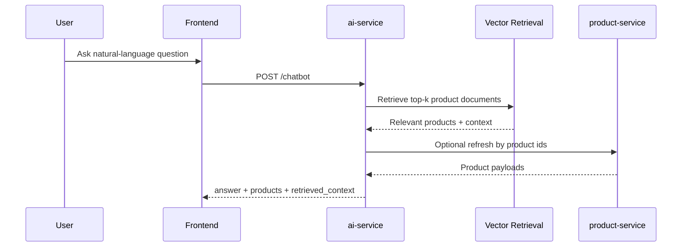

# AI Chatbot and RAG Design

## Goal

Provide a product-advisory chatbot that retrieves real catalog items and produces grounded product suggestions.

## Target flow



## Retrieval document design

Each product document should contain:

- product name
- category name
- detail type
- normalized detail fields
- price
- stock
- optional handcrafted feature text such as affordability bands

### Example document template

```text
Product: Laptop Pro 14
Category: Electronics
Type: electronics
Price: 1299.0
Stock: 10
Brand: TechBrand
Model: LP14-2026
Warranty: 24 months
```

## Chatbot response design

```json
{
  "answer": "Here are budget-friendly grocery items that match your query.",
  "products": [
    {
      "id": 10,
      "name": "Organic Granola",
      "price": 8.5,
      "detail_type": "grocery",
      "score": 0.82,
      "reason": "Matches grocery intent and organic preference."
    }
  ],
  "retrieved_context": [
    "Organic Granola - Grocery - organic - 8.5"
  ]
}
```

## Generation strategy

Phase 8 will use template-grounded generation, not a fake if/else chatbot:

- retrieval must be real
- answer must cite retrieved product context
- product list must come from actual retrieval/recommendation results

## Risk notes

- Query intent extraction is still heuristic; richer NLP can improve classification quality.
- Product corpus remains relatively small, so retrieval diversity is constrained.
- Current generation is template-grounded; a future LLM layer can improve naturalness.
