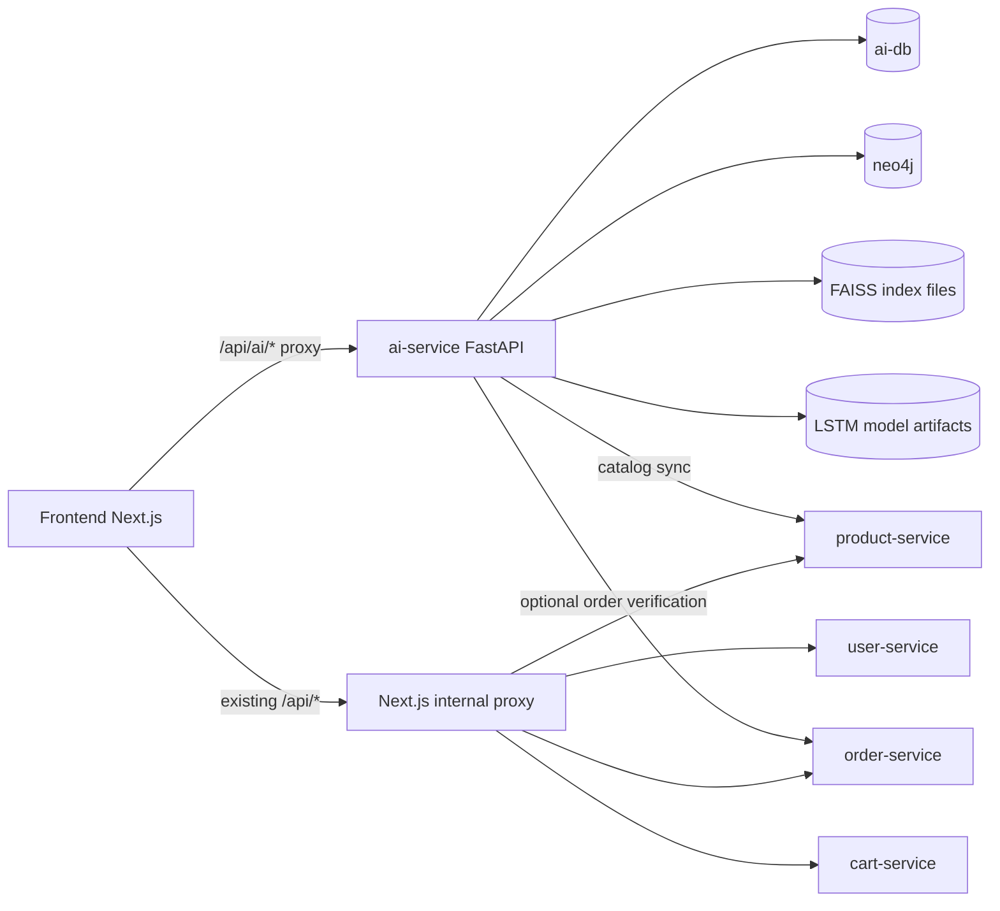
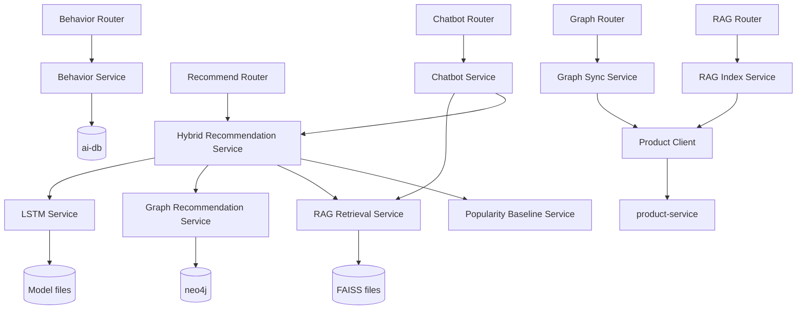

# AI Service Architecture

## Objective

Add a new `ai-service` microservice to the monorepo without breaking existing service contracts, while enabling:

- behavior tracking
- LSTM-based next-product recommendation
- graph-based recommendation
- RAG-based retrieval and chatbot support
- hybrid scoring API

## Target service boundaries

| Component | Responsibility | Storage/runtime |
| --- | --- | --- |
| `ai-service` FastAPI | API, orchestration, ML/graph/RAG services | Python app container |
| `ai-db` | behavior events, sync metadata, experiment metadata | dedicated DB |
| `neo4j` | user-product interaction graph and product similarity graph | Neo4j container |
| FAISS local index | vector retrieval for product docs | local file artifacts/volume |
| model artifacts | LSTM weights, vocab maps, configs | local file artifacts/volume |

## Proposed repo structure

```text
ai-service/
|-- app/
|   |-- main.py
|   |-- config.py
|   |-- db.py
|   |-- clients/
|   |-- graph/
|   |-- ml/
|   |-- rag/
|   |-- routers/
|   |-- schemas/
|   |-- services/
|   `-- utils/
|-- scripts/
|-- tests/
|-- artifacts/
|-- requirements.txt
|-- Dockerfile
`-- README.md
```

## Context diagram



## Internal architecture



## Integration principles

- Keep `ai-service` independent of existing service databases.
- Prefer frontend-side behavior emission first because it is lower-risk.
- Use `product-service` as the authoritative source for catalog sync.
- Keep fallback logic explicit so the demo remains stable even with sparse data.

## Deployment plan

Phase 1 will add:

- `ai-service`
- `ai-db`
- `neo4j`

Docker Compose changes will include:

- new service definitions
- environment variables
- data volumes for model and index artifacts
- startup dependency order
