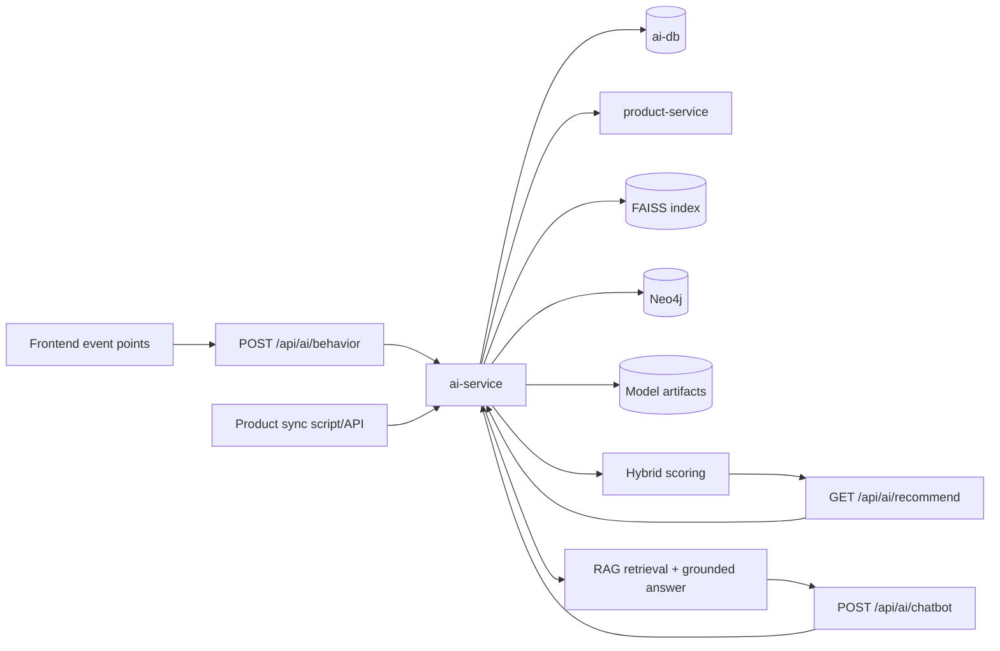

# Phase 0 Integration Flow

```mermaid
flowchart LR
    A[Frontend event points] --> B[POST /api/ai/behavior]
    B --> C[ai-service]
    C --> D[(ai-db)]

    E[Product sync script/API] --> C
    C --> F[product-service]
    C --> G[(FAISS index)]
    C --> H[(Neo4j)]
    C --> I[(Model artifacts)]

    J[GET /api/ai/recommend] --> C
    K[POST /api/ai/chatbot] --> C

    C --> L[Hybrid scoring]
    L --> J
    C --> M[RAG retrieval + grounded answer]
    M --> K
```
