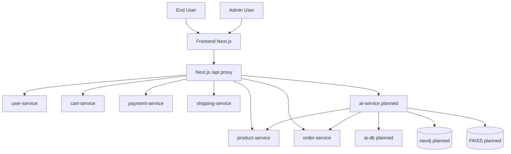

# Phase 0 System Context

```mermaid
flowchart TB
    User[End User]
    Admin[Admin User]
    FE[Frontend Next.js]
    Proxy[Next.js /api proxy]
    PS[product-service]
    US[user-service]
    CS[cart-service]
    OS[order-service]
    Pay[payment-service]
    Ship[shipping-service]
    AIS[ai-service planned]
    AIDB[ai-db planned]
    Neo[(neo4j planned)]
    Faiss[(FAISS planned)]

    User --> FE
    Admin --> FE
    FE --> Proxy
    Proxy --> PS
    Proxy --> US
    Proxy --> CS
    Proxy --> OS
    Proxy --> Pay
    Proxy --> Ship
    Proxy --> AIS

    AIS --> AIDB
    AIS --> Neo
    AIS --> Faiss
    AIS --> PS
    AIS --> OS
```
