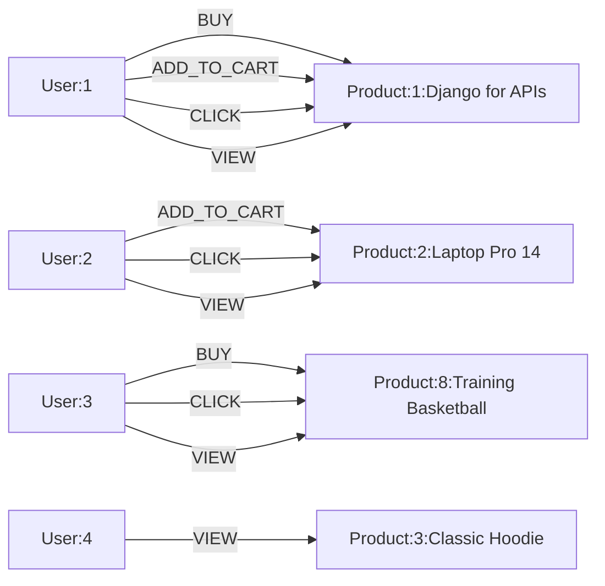

# Phase 4 Graph Snapshot

```mermaid
graph LR
    User_1["User:1"] -->|BUY| Product_1_Django_for_APIs["Product:1:Django for APIs"]
    User_1["User:1"] -->|ADD_TO_CART| Product_1_Django_for_APIs["Product:1:Django for APIs"]
    User_1["User:1"] -->|CLICK| Product_1_Django_for_APIs["Product:1:Django for APIs"]
    User_1["User:1"] -->|VIEW| Product_1_Django_for_APIs["Product:1:Django for APIs"]
    User_2["User:2"] -->|ADD_TO_CART| Product_2_Laptop_Pro_14["Product:2:Laptop Pro 14"]
    User_2["User:2"] -->|CLICK| Product_2_Laptop_Pro_14["Product:2:Laptop Pro 14"]
    User_2["User:2"] -->|VIEW| Product_2_Laptop_Pro_14["Product:2:Laptop Pro 14"]
    User_3["User:3"] -->|BUY| Product_8_Training_Basketball["Product:8:Training Basketball"]
    User_3["User:3"] -->|CLICK| Product_8_Training_Basketball["Product:8:Training Basketball"]
    User_3["User:3"] -->|VIEW| Product_8_Training_Basketball["Product:8:Training Basketball"]
    User_4["User:4"] -->|VIEW| Product_3_Classic_Hoodie["Product:3:Classic Hoodie"]
```

This snapshot is generated from the live Neo4j contents after Phase 4 sync.