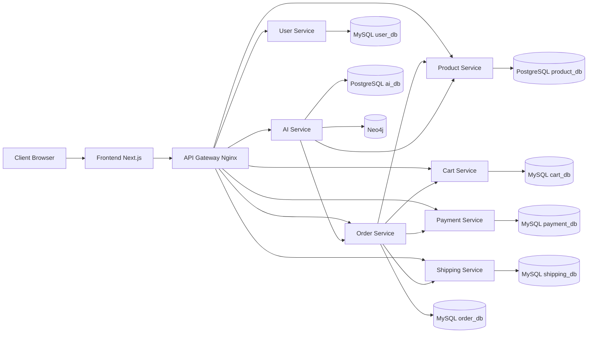

# Chapter 4 Phase 1 System Architecture

## 1. Purpose

This document normalizes the current repository into a Chapter 4 architecture view. The goal of this phase is not to rewrite the system, but to make the architecture explicit, verifiable, and ready for the next implementation phases.

The design principle remains:

- keep the existing microservices implementation
- preserve the working checkout and AI flows
- formalize service boundaries, route exposure, deployment topology, and naming conventions
- prepare the repository for a dedicated Nginx gateway in the next phase

## 2. Normalized architecture overview

### 2.1 Canonical system components

The system is now interpreted under Chapter 4 with the following top-level architecture:

- `gateway/`
- `user-service/`
- `product-service/`
- `cart-service/`
- `order-service/`
- `payment-service/`
- `shipping-service/`
- `ai-service/`
- `frontend/`
- `infrastructure/`

### 2.2 Architecture diagram

### 2.3 Runtime topology summary

#### External access layer

- `frontend` is the user-facing web application.
- `gateway` will become the primary HTTP entry point for backend APIs.
- During the current transition state, the frontend still contains an internal proxy route in `frontend/app/api/[...path]/route.ts`.

#### Application layer

- `user-service` handles authentication and user administration.
- `product-service` exposes the product catalog and category data.
- `cart-service` manages per-user shopping carts.
- `order-service` orchestrates checkout.
- `payment-service` records payment outcomes.
- `shipping-service` records shipping state.
- `ai-service` provides recommendation, chatbot, behavior, graph, and RAG features.

#### Data layer

- each business service owns its own database configuration
- no service uses another service's ORM models or direct foreign-key relationships
- cross-service references are stored as scalar IDs such as `user_id`, `product_id`, and `order_id`

## 3. Service boundaries

### 3.1 Boundary rules

The codebase already follows the main Chapter 4 boundary rules:

- one deployable service per business capability
- one database per service or per AI subsystem
- inter-service communication only through HTTP APIs
- no direct database reads across service boundaries

### 3.2 Ownership model

| Service | Primary responsibility | Owned data store | Notes |
| --- | --- | --- | --- |
| `user-service` | registration, login, admin user management, RBAC identity source | MySQL `user_db` | JWT issuer for user-facing auth |
| `product-service` | categories, products, 10 product detail groups, stock and catalog metadata | PostgreSQL `product_db` | source of truth for product catalog |
| `cart-service` | current cart state per user | MySQL `cart_db` | stores `product_id` references only |
| `order-service` | checkout orchestration, order records, order items, status transitions | MySQL `order_db` | central synchronous orchestrator |
| `payment-service` | payment result persistence and status lookup | MySQL `payment_db` | internal processing endpoint for orders |
| `shipping-service` | shipment creation and shipment status tracking | MySQL `shipping_db` | internal processing endpoint for orders |
| `ai-service` | behavior events, recommendations, chatbot, graph, RAG, model artifacts | PostgreSQL `ai_db` and Neo4j | integrates with product and order contexts |
| `frontend` | presentation layer for customer, staff, and admin workflows | no primary business DB | should not be treated as the official backend gateway in final architecture |

## 4. Service-to-database mapping

| Service | Database engine | Database name | Evidence |
| --- | --- | --- | --- |
| `user-service` | MySQL | `user_db` | `user-service/.env.example`, `docker-compose.yml` |
| `product-service` | PostgreSQL | `product_db` | `product-service/.env.example`, `docker-compose.yml` |
| `cart-service` | MySQL | `cart_db` | `cart-service/.env.example`, `docker-compose.yml` |
| `order-service` | MySQL | `order_db` | `order-service/.env.example`, `docker-compose.yml` |
| `payment-service` | MySQL | `payment_db` | `payment-service/.env.example`, `docker-compose.yml` |
| `shipping-service` | MySQL | `shipping_db` | `shipping-service/.env.example`, `docker-compose.yml` |
| `ai-service` | PostgreSQL + Neo4j | `ai_db` + graph store | `ai-service/.env.example`, `docker-compose.yml` |

## 5. Route exposure model

### 5.1 Canonical Chapter 4 route prefixes

The normalized public route map for the system will be:

- `/api/users/*`
- `/api/products/*`
- `/api/cart/*`
- `/api/orders/*`
- `/api/payments/*`
- `/api/shipping/*`
- `/api/ai/*`

This is the route contract to be enforced by the gateway in the next phase. The internal service implementations may keep their current paths as long as the gateway maps them consistently.

### 5.2 Current service route mapping

| Service | Current backend routes | Chapter 4 public exposure |
| --- | --- | --- |
| `user-service` | `/auth/register`, `/auth/login`, `/users/`, `/users/<id>/` | `/api/users/auth/register`, `/api/users/auth/login`, `/api/users/users/`, `/api/users/users/<id>/` or equivalent normalized mapping in gateway |
| `product-service` | `/products`, `/products/<id>`, `/categories`, `/internal/products/<id>/` | `/api/products/products`, `/api/products/categories`, internal routes stay private |
| `cart-service` | `/cart/add`, `/cart/`, `/cart/update`, `/cart/remove`, `/cart/clear` | `/api/cart/...` |
| `order-service` | `/orders/`, `/orders/<id>` | `/api/orders/...` |
| `payment-service` | `/payment/status`, `/payment/status/<order_id>`, `/internal/payment/pay` | `/api/payments/...`, internal route stays private |
| `shipping-service` | `/shipping/status`, `/shipping/status/<order_id>`, `/internal/shipping/create` | `/api/shipping/...`, internal route stays private |
| `ai-service` | `/health`, `/behavior/*`, `/graph/*`, `/rag/*`, `/recommend`, `/chatbot` | `/api/ai/...` |

### 5.3 Public versus internal routes

#### Public API surface

- user auth and user administration
- product and category browsing
- customer cart actions
- order creation and order tracking
- payment status lookup
- shipping status lookup
- AI recommendation and chatbot APIs

#### Internal-only API surface

- `product-service`: `/internal/products/<id>/`
- `cart-service`: `/internal/cart/<user_id>/`, `/internal/cart/<user_id>/clear`
- `payment-service`: `/internal/payment/pay`
- `shipping-service`: `/internal/shipping/create`

The gateway phase must not expose these internal orchestration routes publicly.

## 6. Authentication trust model

### 6.1 User-facing authentication

- `user-service` issues JWT tokens during login.
- Frontend clients send bearer tokens.
- Downstream Django services validate JWT using the shared signing key.
- RBAC is enforced per service using role claims `admin`, `staff`, and `customer`.

### 6.2 Service-to-service authentication

- `order-service` issues internal bearer tokens using `INTERNAL_SERVICE_JWT_SECRET`.
- downstream internal endpoints validate those internal tokens independently from user JWTs
- internal calls also propagate `X-Correlation-ID` for tracing checkout activity

### 6.3 Gateway role in the target architecture

The target gateway strategy is:

- pass through the `Authorization` header
- preserve client JWT for downstream validation
- preserve or inject forwarding headers
- keep internal orchestration endpoints unreachable from public clients

## 7. Business flow topology

### 7.1 Checkout orchestration

The current authoritative checkout flow is:

1. user authenticates via `user-service`
2. user browses catalog from `product-service`
3. user adds items into `cart-service`
4. user submits checkout to `order-service`
5. `order-service` fetches cart contents from `cart-service`
6. `order-service` validates price and stock via `product-service`
7. `order-service` creates payment via `payment-service`
8. `order-service` creates shipment via `shipping-service`
9. `order-service` clears the cart in `cart-service`

### 7.2 AI integration topology

The current authoritative AI integration flow is:

- `ai-service` retrieves or synchronizes product catalog context from `product-service`
- recommendation APIs combine catalog information with user behavior artifacts
- chatbot APIs generate grounded responses from retrieved catalog context
- `ai-service` may also read order context via its configured `ORDER_SERVICE_URL` when later phases require broader system evidence

## 8. Naming and configuration conventions

### 8.1 Service naming

The repository already uses a mostly consistent convention:

- directory name equals deployable service name
- container name equals service name in compose
- environment variable names follow uppercase snake case

This convention will be preserved.

### 8.2 Environment-variable conventions

The current env strategy is already service-oriented:

- per-service database variables
- shared JWT signing key for user JWT validation
- dedicated internal JWT secret for service-to-service trust
- URL-based service discovery via environment variables

Examples:

- `CART_SERVICE_URL`
- `PRODUCT_SERVICE_URL`
- `PAYMENT_SERVICE_URL`
- `SHIPPING_SERVICE_URL`
- `ORDER_SERVICE_URL`
- `PRODUCT_SERVICE_TIMEOUT_SECONDS`

### 8.3 Network topology conventions

Current Docker Compose uses the default internal compose network. For Chapter 4 interpretation:

- all services are expected to communicate by compose service name
- databases are not intended to be called by other business services directly
- the gateway will join the same compose network and become the official ingress component

## 9. Architecture gaps still remaining after Phase 1

Phase 1 clarifies the architecture, but does not yet complete these implementation items:

- no `gateway/nginx.conf` yet
- no real Nginx service wired into compose yet
- no unified health endpoints across Django services yet
- no monitoring skeleton yet
- no Chapter 4 final acceptance mapping yet

## 10. Deliverables created or normalized in this phase

### Files added

- `docs/chapter4/01-system-architecture.md`
- `gateway/README.md`
- `infrastructure/README.md`

### Chapter 4 criteria addressed in this phase

- system architecture is now explicitly documented
- service boundaries are now formally mapped
- database-per-service pattern is now documented with evidence
- public versus internal route topology is now defined
- the repository now contains explicit `gateway/` and `infrastructure/` components for subsequent phases

### Evidence available

- `docker-compose.yml`
- per-service `.env.example`
- current service route files
- current orchestration code in `order-service`

### Remaining work

- actual gateway implementation
- gateway-to-service route wiring
- formal auth hardening through gateway
- service communication refinements
- observability, evaluation, and evidence packaging
