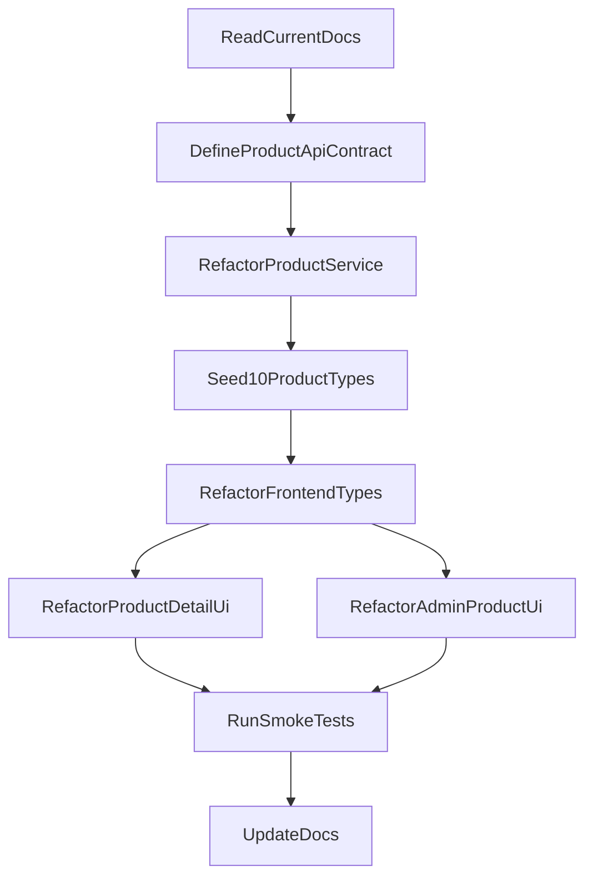

# Kế hoạch mở rộng Product Service lên 10 loại sản phẩm và hiển thị trên FE

## Hiện trạng đã xác nhận
- Monorepo hiện có `product-service` + frontend `Next.js 14`, frontend gọi catalog qua route proxy nội bộ tại [frontend/app/api/[...path]/route.ts](frontend/app/api/[...path]/route.ts).
- Backend product hiện đang khóa cứng ở 3 loại trong [product-service/app/models.py](product-service/app/models.py) và [product-service/app/serializers.py](product-service/app/serializers.py):

```30:86:product-service/app/serializers.py
class ProductSerializer(serializers.ModelSerializer):
    category = serializers.PrimaryKeyRelatedField(queryset=Category.objects.all())
    detail_type = serializers.ChoiceField(
        choices=[("book", "book"), ("electronics", "electronics"), ("fashion", "fashion")],
        write_only=True,
        required=False,
    )
    ...
    def _sync_detail(self, product, detail_type, detail):
        Book.objects.filter(product=product).delete()
        Electronics.objects.filter(product=product).delete()
        Fashion.objects.filter(product=product).delete()
```

- Frontend cũng đang hardcode 3 loại tại [frontend/types/index.ts](frontend/types/index.ts), [frontend/app/products/[id]/page.tsx](frontend/app/products/[id]/page.tsx), và [frontend/app/admin/products/page.tsx](frontend/app/admin/products/page.tsx).
- Seed hiện chỉ có 3 category / product mẫu trong [product-service/app/management/commands/seed_data.py](product-service/app/management/commands/seed_data.py).
- Catalog list ở [frontend/app/page.tsx](frontend/app/page.tsx) gần như đã dùng được nếu API vẫn giữ các field base (`id`, `name`, `price`, `stock`, `category_data`), nhưng trang chi tiết và admin form sẽ không scale nếu tiếp tục giữ logic `if book / electronics / fashion`.

## Định hướng đề xuất
Chọn hướng **chuẩn hóa product detail theo dạng generic/schema-driven**, thay vì thêm thêm 7 bảng detail mới theo pattern hiện tại. Lý do:
- Nếu tiếp tục mô hình `OneToOne` cho từng loại, số model/serializer/form condition sẽ tăng tuyến tính và khó bảo trì.
- Nhu cầu hiện tại đã là 10 loại; khả năng cao sau đó còn mở rộng nữa.
- `order-service` và `cart-service` chỉ phụ thuộc vào base product (`id`, `price`, `stock`), nên có thể refactor phần detail mà ít ảnh hưởng tới flow mua hàng.

Mô hình mục tiêu nên là:
- `Category` giữ vai trò phân nhóm hiển thị.
- `Product` giữ field base như hiện tại.
- Thêm một cấu trúc detail linh hoạt, ưu tiên `JSONField` trong `Product` hoặc một bảng metadata/generic attributes kèm `detail_type`.
- FE render specs từ một config/schema map thay vì `if/else` theo 3 loại cố định.

## Phạm vi triển khai
1. Mở rộng backend để lưu và trả được 10 loại sản phẩm.
2. Seed đồng bộ đủ category + product mẫu cho cả 10 loại.
3. Cập nhật FE để catalog, trang detail, và admin products đều đọc/hiển thị được 10 loại.
4. Cập nhật docs để phản ánh kiến trúc và bộ dữ liệu mới.

## Các bước thực hiện

### 1. Chốt hợp đồng dữ liệu mới cho Product API
- Thiết kế response/request mới tại `product-service` theo hướng thống nhất, ví dụ:
  - `detail_type: string`
  - `detail: Record<string, string | number | boolean>`
  - giữ `category_data` như hiện tại để FE catalog không phải đổi nhiều.
- Bảo đảm endpoint public và internal vẫn ổn định cho các field mà `order-service` cần dùng.
- Rà lại [product-service/app/views.py](product-service/app/views.py) và [order-service/app/service_clients.py](order-service/app/service_clients.py) để chắc rằng internal consumers không bị ảnh hưởng bởi thay đổi detail payload.

### 2. Refactor mô hình dữ liệu trong Product Service
- Cập nhật [product-service/app/models.py](product-service/app/models.py) để bỏ phụ thuộc vào 3 bảng `Book`, `Electronics`, `Fashion` hoặc chuyển chúng sang mô hình tương thích tạm thời rồi migrate dần.
- Tạo migration mới cho schema linh hoạt.
- Refactor [product-service/app/serializers.py](product-service/app/serializers.py) để:
  - bỏ `ChoiceField` hardcode 3 loại,
  - validate `detail_type` theo registry/config,
  - validate `detail` theo schema của từng loại,
  - serialize về cùng một shape thống nhất cho FE.
- Nếu cần, thêm một `product detail registry` (file config riêng) để khai báo 10 loại và bộ field của từng loại thay vì hardcode trong serializer.

### 3. Định nghĩa 10 loại sản phẩm và seed dữ liệu
- Chọn danh sách 10 loại sản phẩm nhất quán giữa backend và FE, ví dụ: `book`, `electronics`, `fashion`, `home-living`, `beauty`, `sports`, `toys`, `grocery`, `office`, `pet-supplies`.
- Cập nhật [product-service/app/management/commands/seed_data.py](product-service/app/management/commands/seed_data.py) để tạo:
  - 10 category,
  - tối thiểu 1-3 sản phẩm mẫu cho mỗi loại,
  - detail payload hợp lệ theo schema từng loại.
- Đảm bảo seed idempotent để chạy lại không tạo trùng dữ liệu.

### 4. Cập nhật type system và API consumption ở frontend
- Refactor [frontend/types/index.ts](frontend/types/index.ts) để bỏ union 3 loại cố định và chuyển sang kiểu generic cho `detail_type` + `detail`.
- Giữ tương thích với shape API mới tại [frontend/lib/api.ts](frontend/lib/api.ts) và [frontend/app/api/[...path]/route.ts](frontend/app/api/[...path]/route.ts); proxy gần như không cần đổi nếu endpoint không thay đổi.
- Xác nhận [frontend/app/page.tsx](frontend/app/page.tsx) và [frontend/components/product-card.tsx](frontend/components/product-card.tsx) vẫn render tốt với dữ liệu base của 10 loại.

### 5. Refactor trang Product Detail theo hướng schema-driven
- Thay logic đang hardcode trong [frontend/app/products/[id]/page.tsx](frontend/app/products/[id]/page.tsx):

```131:149:frontend/app/products/[id]/page.tsx
{product.book && (...)}
{product.electronics && (...)}
{product.fashion && (...)}
```

- Thay bằng một renderer tổng quát:
  - đọc `detail_type`,
  - tra một config map chứa label/format của từng field,
  - render `detail` thành danh sách specs động.
- Bổ sung fallback UI cho trường hợp type mới chưa có config hiển thị đẹp: vẫn render key/value cơ bản thay vì trắng trang.

### 6. Refactor admin products để quản trị được 10 loại
- Cập nhật [frontend/app/admin/products/page.tsx](frontend/app/admin/products/page.tsx) vì đây là điểm hardcode nặng nhất hiện tại.
- Thay các phần sau bằng config dùng chung:
  - `defaultForm`
  - `getDetailDraft()`
  - dropdown `detail_type`
  - `detailFields`
  - logic map dữ liệu lúc edit product.
- Mục tiêu là admin form sinh field từ một schema registry thay vì `if book / electronics / fashion`.
- Nếu cần, tách schema này ra file cấu hình riêng để tái sử dụng cho detail page và admin form, tránh khai báo lặp.

### 7. Cập nhật tài liệu dự án
- Cập nhật tối thiểu các tài liệu sau để phản ánh kiến trúc mới:
  - [README.md](README.md)
  - [IMPLEMENT.MD](IMPLEMENT.MD)
  - [docs/frontend-ui-overview.md](docs/frontend-ui-overview.md)
- Nội dung cần cập nhật:
  - product model mới,
  - danh sách 10 loại sản phẩm,
  - shape API mới,
  - seed behavior mới,
  - tác động tối thiểu tới order/cart flow.

### 8. Kiểm thử và nghiệm thu
- Backend:
  - test CRUD product với nhiều `detail_type`,
  - test validation detail theo schema,
  - test internal endpoint vẫn trả đủ dữ liệu cho `order-service`.
- Frontend:
  - smoke test catalog page hiển thị được dữ liệu seed mới,
  - smoke test product detail của nhiều loại khác nhau,
  - smoke test admin create/edit/delete với ít nhất 2-3 type mới ngoài 3 type cũ.
- E2E tối thiểu:
  - thêm sản phẩm mới vào cart,
  - checkout thành công với dữ liệu sau refactor.

## File dự kiến tác động nhiều nhất
- [product-service/app/models.py](product-service/app/models.py)
- [product-service/app/serializers.py](product-service/app/serializers.py)
- [product-service/app/management/commands/seed_data.py](product-service/app/management/commands/seed_data.py)
- [frontend/types/index.ts](frontend/types/index.ts)
- [frontend/app/products/[id]/page.tsx](frontend/app/products/[id]/page.tsx)
- [frontend/app/admin/products/page.tsx](frontend/app/admin/products/page.tsx)
- [README.md](README.md)
- [IMPLEMENT.MD](IMPLEMENT.MD)
- [docs/frontend-ui-overview.md](docs/frontend-ui-overview.md)

## Trình tự triển khai khuyến nghị


## Rủi ro cần lưu ý
- Nếu dữ liệu cũ đang được dùng ở môi trường demo, migration từ mô hình 3 bảng detail sang mô hình generic cần có chiến lược chuyển đổi hoặc reset seed rõ ràng.
- Nếu muốn giữ backward compatibility với response cũ, serializer có thể phải hỗ trợ song song một giai đoạn ngắn.
- Nếu danh sách “10 loại sản phẩm” đã được chốt từ phía nghiệp vụ, cần dùng đúng taxonomy đó ngay từ đầu để tránh sửa seed/UI 2 lần.

## Tiêu chí hoàn thành
- `product-service` tạo, cập nhật, đọc được 10 loại sản phẩm qua cùng một contract nhất quán.
- Seed tạo đủ dữ liệu demo cho 10 loại.
- FE catalog hiển thị được toàn bộ sản phẩm seed mới.
- FE product detail hiển thị đúng specs theo từng loại.
- Admin UI tạo/sửa/xóa được sản phẩm của cả 10 loại mà không cần thêm code condition riêng cho từng loại mới.
